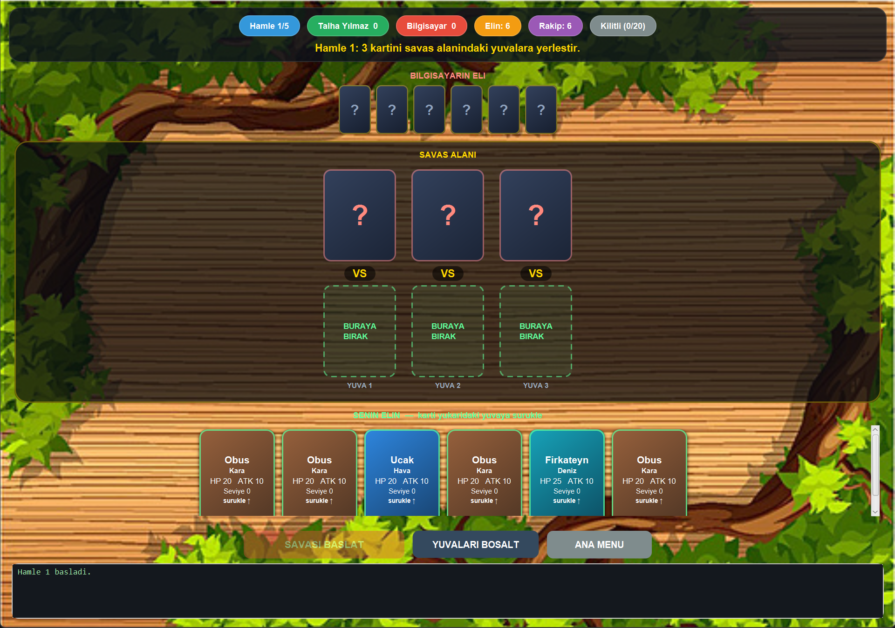

# Savaş Araçları Kart Oyunu

Hava, kara ve deniz savaş araçlarıyla bilgisayara karşı oynanan, JavaFX ile yazılmış nesne yönelimli kart oyunu.

Kocaeli Üniversitesi Bilgisayar Mühendisliği, Programlama Laboratuvarı I dersi 2024-2025 Güz dönemi ikinci projesi olarak geliştirildi.

> **Not:** Proje Kasım 2024'te teslim edildi. Depoya yüklenmeden önce oyun mantığı arayüzden ayrıldı, kural hataları düzeltildi ve arayüz yeniden tasarlandı.



## Gereksinimler

- JDK 17 veya üzeri
- Maven (proje Maven Wrapper içerir, ayrıca kurmana gerek yok)

## Çalıştırma

Linux / macOS:

```bash
./mvnw javafx:run
```

Windows (PowerShell):

```powershell
.\mvnw.cmd javafx:run
```

IntelliJ IDEA kullanıyorsan: Maven paneli → `Plugins` → `javafx` → `javafx:run`.

Uygulamayı IDE'den doğrudan çalıştırmak istersen **`Oyun` sınıfını** çalıştır. `OyunUI` sınıfı `Application`'dan türediği için doğrudan başlatılamaz; JVM o durumda JavaFX'in modül yolunda olmasını ister ve `JavaFX runtime components are missing` hatası verir.

Tek dosyalık JAR üretmek için:

```bash
./mvnw clean package
java -jar target/savas-araclari-oyunu-1.0.0.jar
```

JavaFX kütüphaneleri platforma özgü olduğundan üretilen JAR yalnızca üretildiği işletim sisteminde çalışır.

## Oynanış

Her iki taraf 6 kartla başlar. Her hamlede oyuncu elinden 3 kart seçip savaş alanındaki yuvalara yerleştirir, bilgisayar da rastgele 3 kart seçer. Aynı sıradaki kartlar karşılıklı olarak çarpışır: 1. yuva 1. yuvayla, 2. yuva 2. yuvayla, 3. yuva 3. yuvayla.

Saldırı değeri kartın vuruş özelliğidir. Saldıran kartın sınıfı hedefin sınıfına karşı avantajlıysa, vuruş avantajı da eklenir:

```
Hava  →  Kara  →  Deniz  →  Hava
```

Bazı kartların kendi sınıflarına özgü ikinci bir avantajı vardır: Siha denize, KFS havaya, Sida karaya karşı ayrıca avantajlıdır.

Dayanıklılığı sıfırın altına düşen kart elenir. Kartı eleyen taraf, elenen kartın seviye puanı kadar (en az 10) seviye ve skor kazanır. 20 seviye puanına ulaşan tarafa Siha, Sida ve KFS kartları da dağıtılmaya başlar.

Bir hamlenin sonunda her tarafa yeni kart verilir. Elinde tek kart kalan tarafa, elini üçe tamamlayabilmesi için iki kart verilir.

Oyun iki koşuldan biriyle biter: taraflardan birinin kartları tükenir, ya da belirlenen hamle sayısı dolar. İkinci durumda yüksek skor kazanır; skorlar eşitse elde kalan kartların toplam dayanıklılığı belirler ve aradaki fark kazananın skoruna eklenir.

Oyun başında oyuncu adı, maksimum hamle sayısı ve kartların başlangıç seviye puanı ayarlanabilir.

## Kart özellikleri

| Kart | Sınıf | Dayanıklılık | Vuruş | Vuruş avantajları |
|---|---|---|---|---|
| Uçak | Hava | 20 | 10 | Kara 10 |
| Siha | Hava | 15 | 10 | Kara 10, Deniz 10 |
| Obüs | Kara | 20 | 10 | Deniz 5 |
| KFS | Kara | 10 | 10 | Deniz 10, Hava 20 |
| Fırkateyn | Deniz | 25 | 10 | Hava 5 |
| Sida | Deniz | 15 | 10 | Hava 10, Kara 10 |

Uçak, Obüs ve Fırkateyn oyunun başından itibaren dağıtılır. Siha, KFS ve Sida yalnızca seviye eşiğini geçen taraf için dağıtıma dahil olur.

## Sınıf yapısı

```
SavasAraclari (abstract)
├── Hava (abstract)          → Ucak, Siha
├── Kara (abstract)          → Obus, KFS
└── Deniz (abstract)         → Firkateyn, Sida

Oyuncu        oyuncu ve bilgisayarın eli, skoru, kart seçimi
Oyun          kurallar, saldırı hesabı, kart dağıtımı, kazanan belirleme, main
OyunUI        JavaFX arayüzü
HamleSonucu   bir hamlenin sonucu
Carpisma      tek bir kart çiftinin çarpışma sonucu
```

Oyun kurallarına dair tüm hesaplama `Oyun` sınıfındadır; `OyunUI` yalnızca durumu gösterir ve kullanıcının seçimlerini iletir. Bu ayrım sayesinde oyun motoru arayüz olmadan da test edilebilir.

`Oyun.SaldiriHesapla` karşı karşıya gelen iki kartın birbirine yapacağı saldırı miktarlarını hesaplayıp iki elemanlı dizi olarak döndürür; hiçbir kartın durumunu değiştirmez. Hasarın uygulanması, eleme ve puanlama ayrı adımlarda yapılır.

## Çıktı dosyası

Oyun bittiğinde bütün adımlar `SavasAraclari.txt` dosyasına yazılır: her hamlede seçilen kartlar, karşılıklı saldırı değerleri, kartların hamle sonundaki dayanıklılık ve seviye puanları, elenen kartlar, dağıtılan yeni kartlar ve nihai skorlar.

## Proje yapısı

```
savas-araclari-oyunu/
├── pom.xml
├── mvnw, mvnw.cmd, .mvn/
└── src/main/
    ├── java/          15 sınıf
    └── resources/png/ arka plan görseli
```

## Kullanılan teknolojiler

Java 17, JavaFX 21, Maven

## Lisans

MIT — ayrıntılar için `LICENSE` dosyasına bak.